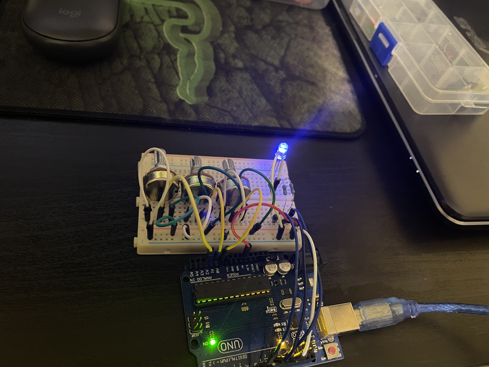
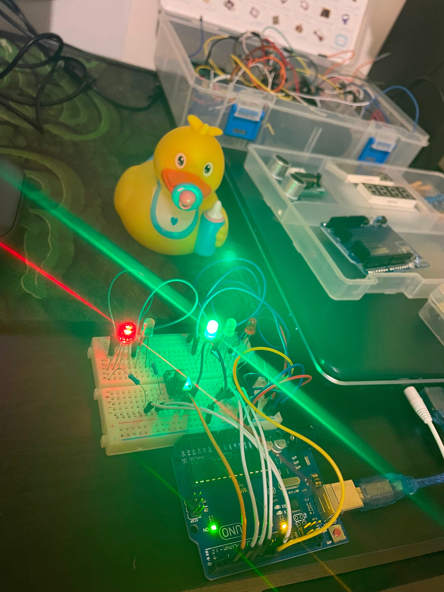
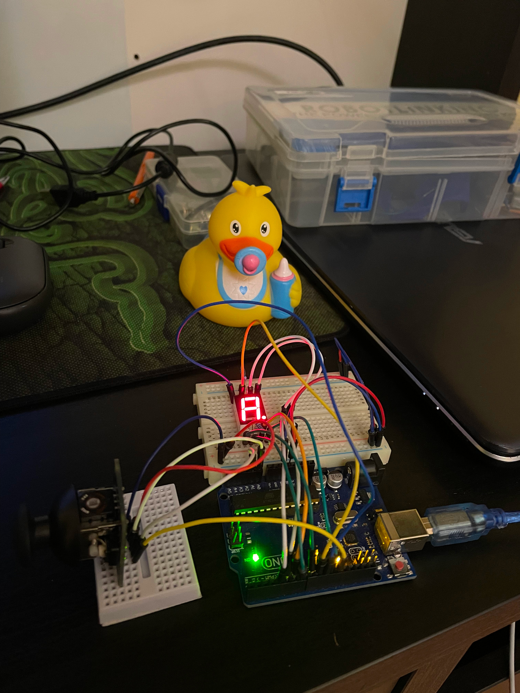
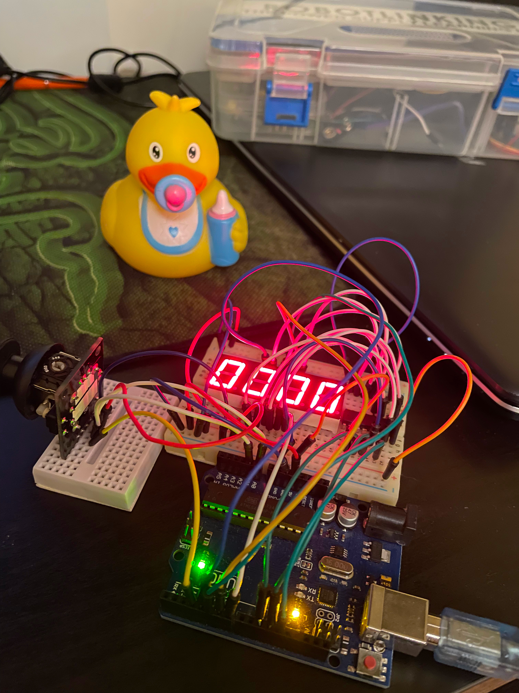
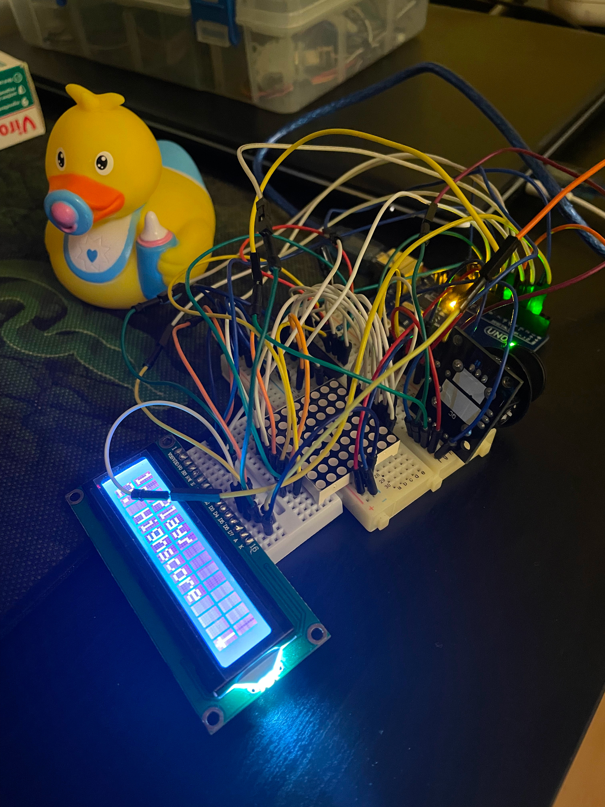

# Introduction to Robotics

Learning interesting stuff about robotics.

- [Introduction to Robotics](#introduction-to-robotics)
  - [Homework 1](#homework-1)
  - [Homework 2](#homework-2)
    - [Clean code thoughts](#clean-code-thoughts)
  - [Homework 3](#homework-3)
  - [Homework 4](#homework-4)
  - [Homework 5](#homework-5)
  - [Useful resources](#useful-resources)

---

## Homework 1

The code for this homework can be found [here](./homework//hw1/hw1.ino).

Task requirements:

* there will be 3 potentiometers, each of which corresponding to an RGB color
* gather input from each of the potentiometers
* properly map the value from a `0-1023` range to a `0-255` range
* send the converted value to the right output PIN

The set-up:

<div style="text-align: center;">
  
</div>

The video showcasing the functionality can be found [here](https://youtube.com/shorts/_Dd5iX8rpv8?feature=share).

Interesting challenges:

* there is a single 5V pin on the Arduino board and 3 different potentiometers which require a source; then I recalled how [a breadboard works](https://thimble.io/how-to-use-a-breadboard-an-in-depth-guide/#:~:text=On%20most%20breadboards%2C%20they%20are,side%20of%20the%20center%20groove.) and found the solution: to use the *+* and *-* columns

---

## Homework 2

The code for this homework can be found [here](./homework/hw2/hw2.ino).

The task is to build a simple traffic lights system.

Task requirements:

* 2 LEDs for people lights
* 3 LEDs for cars lights
* 1 buzzer
* one button

The set-up:

<div style="text-align: center;">
  
</div>

The video showcasing the functionality can be found [here](https://youtube.com/shorts/H1kWlkVmIcw?feature=share).

### Clean code thoughts

I was tempted to refactor common logic into separated functions. For instance, I'd encapsulate these lines in a `beepBuzzer` function:

```c
if (isBuzzerActive) {
  tone(BUZZER_PIN, 1000);
} else {
  noTone(BUZZER_PIN);
}

unsigned long elapsedBuzzerTime = millis() - buzzerStartTimestamp;
if (elapsedBuzzerTime > BUZZER_STATE3_INTERVAL_MS) {
  isBuzzerActive = !isBuzzerActive;
  buzzerStartTimestamp = millis();
}
```

However, the problem I had encountered was that the function could not be 100% pure. As in, `beepBuzzer` might need a `beepInterval`, but 1) it can't be declared in the function's body and 2) the `beepInterval` might also be different, depending the context the function is used in(i.e. different stages require different intervals). So, I decided that it wasn't worth it.

---

## Homework 3


The code for this homework can be found [here](./homework/hw32/../hw3/hw3.ino).

The set-up:

<div style="text-align: center;">
  
</div>

The video showcasing the functionality can be found [here](https://youtu.be/K1T9R4ys6N8).

---

## Homework 4

The code for this homework can be found [here](./homework/hw32/../hw4/hw4.ino).

The set-up:

<div style="text-align: center;">
  
</div>

The video showcasing the functionality can be found [here](https://youtube.com/shorts/RTMY486Oq6M?feature=share).

---

## Homework 5

The code for this homework can be found [here](./homework/hw32/../hw5/hw5.ino).

The set-up:

<div style="text-align: center;">
  
</div>

The video showcasing the functionality can be found [here](https://youtu.be/XJ1ansnsYRw).


## Useful resources

* https://roboticsbackend.com/arduino-uno-pins-a-complete-practical-guide/
* https://www.autodesk.com/products/eagle/blog/how-does-ground-work-in-electronics/
* [Arduino Tutorial 8: Understanding Pulse Width Modulation (PWM) and the Arduino Analog Write Command](https://www.youtube.com/watch?v=YfV-vYT3yfQ)
